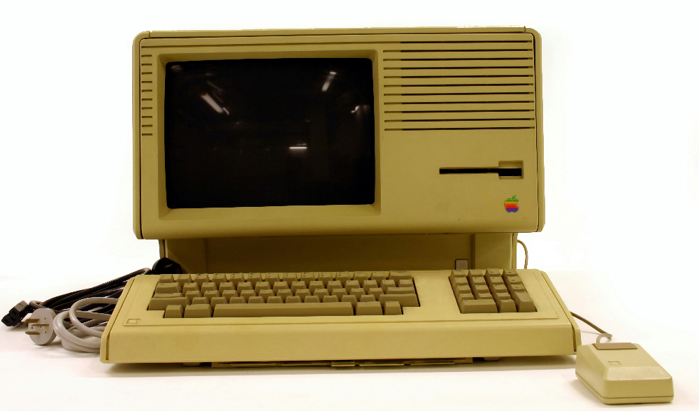

<!DOCTYPE html>
<html>

<head>
    <title>Origins of the Web</title>
    <meta charset="utf—8">
     
</head>

<body style="font-family: Arial, Helvetica, sans-serif; padding: 20px;">
    <nav>
        <a href="index.html" style="text-decoration: none; color:black;">web 1.0</a>  |  <a href="web-2.0.html" style="text-decoration: none; color:black;">web 2.0</a>  | <a href="web-3.0.html" style="text-decoration: none; color:black;">web 3.0</a>  |  <a href="web-4.0.html" style="text-decoration: none; color:black;">web 4.0</a>
    </nav>
    <header style="margin-right: 250px; margin-left: 250px;">
        <h1>Where does the Web come from?</h1>
        <h2>The Static Web - Web 1.0</h2>
        
    </header>
    
    
</body>
</html>

<html>
<body style="font-family: Arial, Helvetica, sans-serif; padding: 20px;">
    <main>
            
Web 1.0 is often described as the “read-only” Web. It was characterized by static web pages with very limited user interaction. Most websites served as online brochures or repositories of information, where users could view content but could not easily contribute or modify it.
        

    
        
This early stage of the Web was dominated by institutional and corporate websites that provided information but offered little opportunity for collaboration or participation.

        
link to the first web <a href="https://info.cern.ch/" target="_blank">site</a>

        </main>
        <footer style="width: 700px; margin:auto; text-align:right;">
                <small>© Nicole Tanev, cart 211, fall 2026, assessment 1</small>
        </footer>
</body>
</html>
